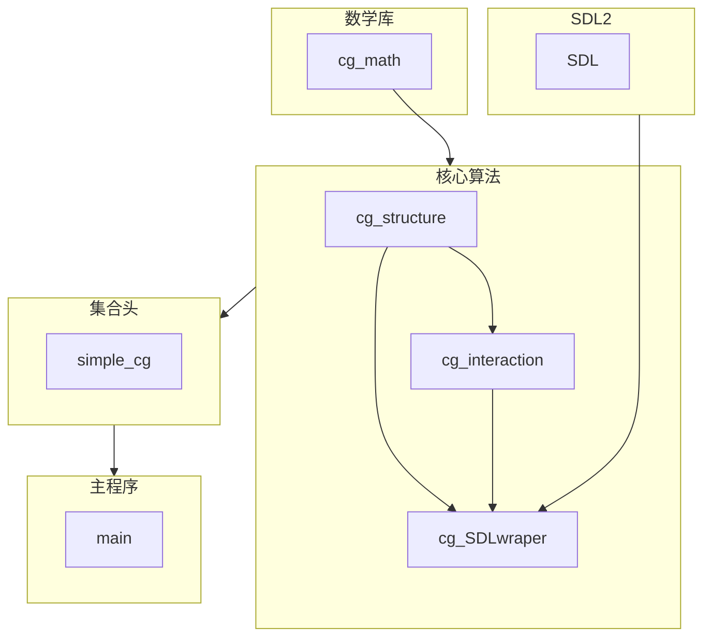

# SimpleRayTracing-with-SDL2
An implementation of simple raytracing written in C++ with SDL2.

```mermaid
flowchart TD
	math[cg_math]
	alg1[cg_structure]
	alg3[cg_SDLwraper]
	alg2[cg_interaction]
	alg[simple_cg]
	main[main]
	SDL[SDL]
	
	subgraph SDL2[SDL2]
		SDL
	end
	subgraph Math[数学库]
		math
	end

	
	subgraph Algorithm[核心算法]
		alg2
		alg3
		alg1
	end
	
	subgraph collect[集合头]
		alg
	end
	
	subgraph Main[主程序]
		main
	end
	
	Math ~~~ Algorithm
	SDL ~~~ Algorithm
	Algorithm ~~~ collect
	
	math --> Algorithm
	SDL2 --> alg3
	alg1 --> alg2
	alg1 --> alg3
	alg2 --> alg3
	Algorithm --> collect
	collect --> Main
```

